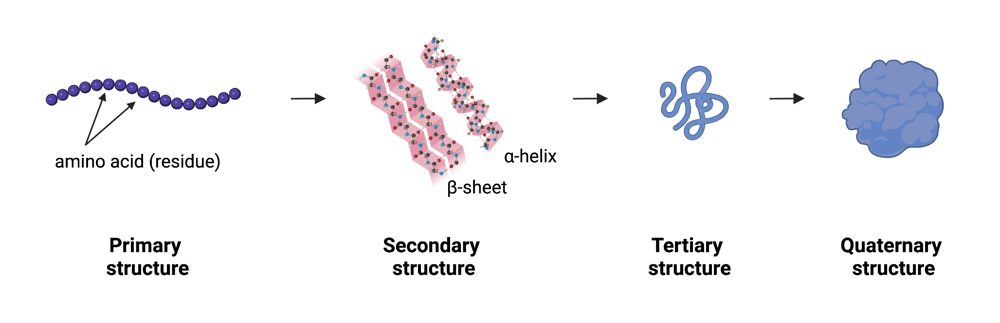
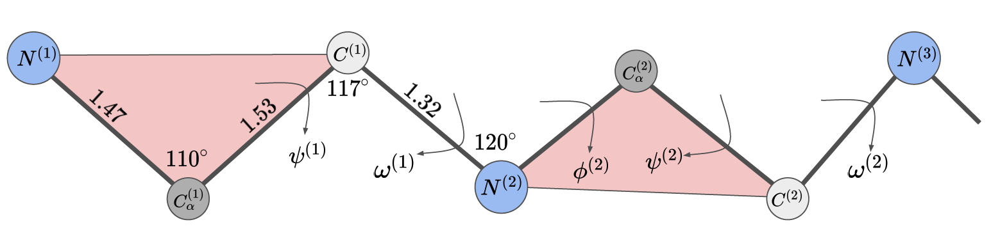

[There are 4 levels of protein structure:](https://www.khanacademy.org/science/biology/macromolecules/proteins-and-amino-acids/a/orders-of-protein-structure)
1. **Primary:** sequence of amino acids (also called residues)
2. **Secondary:** refers to local folded structures that form within a polypeptide due to interactions between atoms of the backbone. (The backbone just refers to the polypeptide chain apart from the R groups – so all we mean here is that secondary structure does not involve R group atoms.)
3. **Tertiary:**The overall three-dimensional structure of a polypeptide is called its tertiary structure. The tertiary structure is primarily due to interactions between the R groups of the amino acids that make up the protein.
4. **Quaternary:** Some proteins are made up of multiple polypeptide chains.

**On chains**: A protein can have multiple polypeptide chains. Each chain has its own set of amino acids, assembled in a particular order (a primary sequence).

Protein-design can refer to a design-problem at any of these 4 levels. 

#### Ways to Represent a Protein Backbone (adapted/excerpted from this [post](https://dauparas.github.io/post/af2/)):

A protein backbone is a repeating sequence (linear chain) of 3 atoms: nitrogen, carbon, and another carbon, namely $$\underbrace{N^{(1)}, C_{\alpha}^{(1)}, C^{(1)}}, \underbrace{N^{(2)}, C_{\alpha}^{(2)}, C^{(2)}},…,\underbrace{N^{(L)}, C_{\alpha}^{(L)}, C^{(L)}}$$. for the protein of length L. The middle carbon has a special name. It is called “C alpha” because that is where the side chain is connected to. The first three atoms belong to the first amino acid (first residue), the next three to the next amino acid (next residue) etc.

Predicting backbone configurations in 3D space may seem to be straightforward, but is in fact challenging because atoms that are far in the sequence space (primary protein structure) can be close in 3D space and they can interact. This suggests that non-local modelling is needed to accurately predict tertiary structure. At the same time, protein backbones have a clearly defined local structure (bond lengths and angles are fixed). Choosing to focus on local and/or non-local interactions leads to different backbone representations. In the following, we will describe four common ways of representing the protein backbone.

#### 1. XYZ Coordinates of Atoms

Protein backbone atoms can be described using XYZ coordinates. The first residue is composed of $$N^{(1)}, C_{\alpha}^{(1)}$$ and $$C^{(1)}$$ each of which has an X, Y, and Z coordinate. This results in a 3 by 3 matrix that represents the entire residue. When you stack these together for the whole backbone of length $$L$$ you generate a tensor $$X$$: $$X\in \mathbb{R}^{3\times 3 \times L}$$. Remember that some distances and angles between backbone atoms (within and between residues) are fixed, so these coordinates will have to satisfy those constraints to result in a valid protein structure. 

#### 2. XYZ Coordinates of $$C_\alpha$$ + Orientation

This representation is based on the premise that distances and angles between $$C_{\alpha}^{(i)}$$ and $$N^{i}$$ and $$C^{i}$$ are fixed. Therefore it is enough to represent the XYZ coordinates of $$C_{\alpha}^{(i)}$$ and the orientation of these atoms relative to $$C_{\alpha}^{(i)}$$. There will still be constraints on the distance and angle between adjacent residues that need to be satisfied for the local geometry to be feasible, but otherwise this representation automatically preserves intrinsic residue geometry. AlphaFold 2 used this representation in their structure module.

#### 3. Protein Torsion (Dihedral) Angles

Since bond lengths and angles between neighbouring backbone atoms are fixed, the only remaining degrees of freedom are the torsion (dihedral) angles. 

A torsion (dihedral) angle is the angle between two intersecting planes, in this case it is the angle between the green and the red planes. Mathematically we define the function called 
**Torsion** which takes in 4 points in a chain $$C^{(1)}, N^{(2)}, C_{\alpha}^{(2)}, C^{(2)}$$ and outputs the angle between the planes created by $$C^{(1)}, N^{(2)}, C_{\alpha}^{(2)}$$ and $$N^{(2)}, C_{\alpha}^{(2)}, C^{(2)}$$ as a value between $$-\pi$$ and $$\pi$$. We write this as $$\phi^{(2)}=\text{Torsion}(C^{(1)}, N^{(2)}, C_{\alpha}^{(2)}, C^{(2)})\in [-\pi, \pi]$$.

Demonstrated in the picture above, each torsion angle has a specific name in protein literature. They are defined as 
$$
\begin{align} \\
\phi^{(i)}&=\text{Torsion}(C^{(i-1)}, N^{(i)}, C_{\alpha}^{(i)}, C^{(i)}),\\ 
\psi^{(i)}&=\text{Torsion}(N^{(i)}, C_{\alpha}^{(i)}, C^{(i)}, N^{(i+1)}),\\ 
\omega^{(i)}&=\text{Torsion}(C_{\alpha}^{(i)}, C^{(i)}, N^{(i+1)}, C_{\alpha}^{(i+1)}),
\end{align}
$$

where $$i = 1, 2, 3…, L$$. Notice that $$\phi^{(1)}$$ and $$\psi^{(L)}, \omega^{(L)}$$ are not defined because there are no $$C^{(0)}$$ and $$N^{(L+1)}$$. Therefore a protein backbone can be represented as a sequence of torsion angles: $$\psi^{(1)}, \omega^{(1)}, \phi^{(2)}, \psi^{(2)}, \omega^{(2)},…,\phi^{(L)}$$. This representation is independent of the frame of reference and it does not have any local bond length/angle constraints, but it suffers from the lever arm effect meaning that small errors propagate along the backbone. Interestingly, AlphaFold 1 predicted torsion angles to initialise the gradient descent algorithm to optimize the relative distance potentials to obtain the protein structure.

#### 4. Relative Distances and Angles between Residues

Another way to represent backbone atoms without a frame of reference is to use the pairwise distance and angle representations. One choice could be to represent relative distances between $$C_{\alpha}$$ coordinates and relative orientations (e.g. Euler angles) between red triangles. Denote the Euclidean distance between $$C_{\alpha}^{(i)}$$ and $$C_{\alpha}^{(j)}$$ as the distance matrix $$D_{\alpha}^{(ij)}$$: $$D^{(ij)}_{\alpha}=\sqrt{(X_{\alpha}^{(i)}-X_{\alpha}^{(j)})\cdot(X_{\alpha}^{(i)}-X_{\alpha}^{(j)})}=\left\lVert(X_{\alpha}^{(i)}-X_{\alpha}^{(j)})\right \rVert_2$$.

The $$(D^{(ij)}_{\alpha})^2$$ matrix has some special properties. If we write out the dot product we get 
$$\begin{align}
(D^{(ij)}_{\alpha})^2=&(X_{\alpha}^{(i)}\cdot X_{\alpha}^{(i)}+X_{\alpha}^{(j)}X_{\alpha}^{(j)}-2X_{\alpha}^{(i)}X_{\alpha}^{(j)}),\\ 
(D^{(ij)}_{\alpha})^2=&(G_{\alpha}^{(ii)}+G_{\alpha}^{(jj)}-2G_{\alpha}^{(ij)}),\\ 
G_{\alpha}^{(ij)} :=& X_{\alpha}^{(i)}X_{\alpha}^{(j)},
\end{align}$$

Where $$G_{\alpha}^{(ij)}$$ is known as a Gram matrix. The Gram matrix has rank 3 because it is a product of two 3-dimensional vectors $$X_{\alpha}^{(i)}$$ and $$X_{\alpha}^{(j)}$$. and therefore the square of the distance matrix has rank ≤ 1 + 1 + 3 = 5. There are requirements for the geometrically centred distance matrix to be positive semi-definite (meaning all eigenvalues are greater or equal to zero). Read more about Euclidean Distance Matrices here. It is a global representation of the structure. If one has a distance matrix, there is a simple algorithm to obtain coordinates that satisfy those distances. It is called Multidimensional scaling (MDS); see the [original post](https://dauparas.github.io/post/af2/) for more details.

Other Links:
- [Experimental Work](https://static1.squarespace.com/static/5f02f3b0ad0f7674bd06666c/t/630f4d5b11965036e29057ce/1661947232017/220831-ii+Brief+Introduction+to+the+Very+Basics+of+Mass+Spec+Proteomics.pdf)
- [Protein Language Models](https://github.com/biolists/folding_tools/blob/main/pLM.md)
- [Protein Design on Hugging Face](https://twitter.com/carrigmat/status/1535311094033547264)